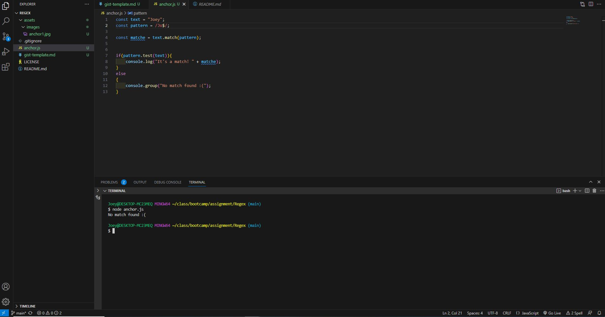

# Title (replace with your title)

Introductory paragraph (replace this with your text)

## Summary

Briefly summarize the regex you will be describing and what you will explain. Include a code snippet of the regex. Replace this text with your summary.

## Table of Contents

- [Anchors](#anchors)
- [Quantifiers](#quantifiers)
- [OR Operator](#or-operator)
- [Character Classes](#character-classes)
- [Flags](#flags)
- [Grouping and Capturing](#grouping-and-capturing)
- [Bracket Expressions](#bracket-expressions)
- [Greedy and Lazy Match](#greedy-and-lazy-match)
- [Boundaries](#boundaries)
- [Back-references](#back-references)
- [Look-ahead and Look-behind](#look-ahead-and-look-behind)

## Regex Components

### Anchors

Anchors do not match any character, but rather, they match a position before or after characters. The two main anchors that you will see are "^" and "$".

^ - Represents the start of the anchor
$ - Represents the end of an anchor

(NOTE: Regex is case sensitive! if you set a Regex command to find "Hello", if you make it `/^hello$/`, the "Hello" will not be returned.)

Below is an example of using the `^` in Regex. In the example, I'm using /^J/.

You can see here that it matches with my string "Joey". That is because "Joey" starts with "Jo", and therefore it returns true! If I made my pattern something else like "Job" though, it would return with no match.

Below is an example of using the `$` in Regex. In the example, I'm using "/Jo$/gm".

Here you can see that it returns false. This is because "Joey" doesn't end with "Jo", it begins with "Jo". "Joey" ends with "ey", so in order to get this to return, we need to make it `/ey$/`.

Below is an example of using both the `^` and `$` together in Regex. For this one, it basically finds the exact string! In the example below, my string is "JoeyLee" and I set my anchor tags to find the word "Joey". As you can see below, it couldn't find a match.

"Joey" exists in "JoeyLee", but with our anchor tags `^` and `$`, we'll need to find the exact thing, so we're going to need to make it look for "JoeyLee" in order to get a match!

### Quantifiers

### OR Operator

### Character Classes

### Flags

### Grouping and Capturing

### Bracket Expressions

### Greedy and Lazy Match

### Boundaries

### Back-references

### Look-ahead and Look-behind

## Author

A short section about the author with a link to the author's GitHub profile (replace with your information and a link to your profile)
