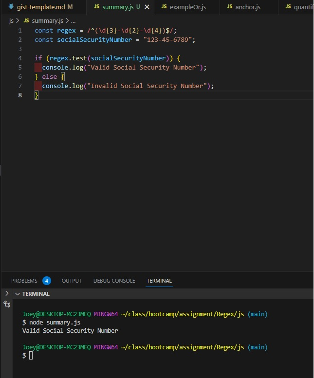
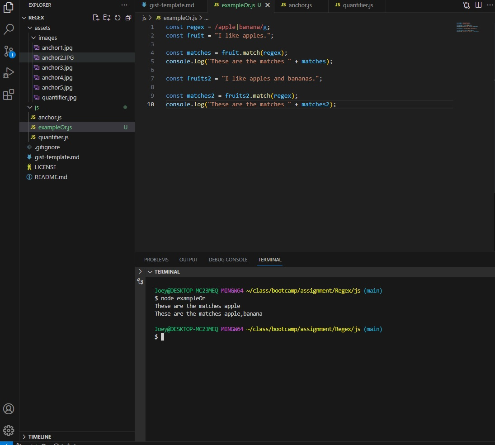

# Regex Explained!

Introductory paragraph (replace this with your text)

## Summary

Regex is a useful tool in order to check if things are valid or not. Things like e-mail, passwords, phone numbers, and much more can be checked with regex to make sure that it matches proper format!

For my example, I will use an example of a regex for social security numbers!

Social security numbers are written as followed

XXX-XX-XXXX - 3 number digits, then 2 number digits, and lastly 4 number digits.

 The way you would write this regex would be...

` /^(\d{3}-\d{2}-\d{4})$/`

^ and $ - anchors that respectively indicate the start and end of the string. This means the whole string must match the pattern.  

\d matches any digit (equivalent to [0-9]).  

{3} specifies that the preceding element (in this case, \d) must occur exactly 3 times. 

`-` - matches a literal hyphen character. 

{2} specifies that the preceding element (again, \d) must occur exactly 2 times.  

{4} specifies that the preceding element (once more, \d) must occur exactly 4 times.

Below would be an example of what it would look like

## Table of Contents

- [Anchors](#anchors)
- [Quantifiers](#quantifiers)
- [OR Operator](#or-operator)
- [Character Classes](#character-classes)
- [Flags](#flags)
- [Grouping and Capturing](#grouping-and-capturing)
- [Bracket Expressions](#bracket-expressions)
- [Greedy and Lazy Match](#greedy-and-lazy-match)
- [Boundaries](#boundaries)
- [Back-references](#back-references)
- [Look-ahead and Look-behind](#look-ahead-and-look-behind)

## Regex Components

### Anchors

Anchors do not match any character, but rather, they match a position before or after characters. The two main anchors that you will see are "^" and "$".

^ - Represents the start of the anchor
$ - Represents the end of an anchor

(NOTE: Regex is case sensitive! if you set a Regex command to find "Hello", if you make it `/^hello$/`, the "Hello" will not be returned.)

Below is an example of using the `^` in Regex. In the example, I'm using /^J/.

You can see here that it matches with my string "Joey". That is because "Joey" starts with "Jo", and therefore it returns true! If I made my pattern something else like "Job" though, it would return with no match.

Below is an example of using the `$` in Regex. In the example, I'm using "/Jo$/gm".

Here you can see that it returns false. This is because "Joey" doesn't end with "Jo", it begins with "Jo". "Joey" ends with "ey", so in order to get this to return, we need to make it `/ey$/`.

Below is an example of using both the `^` and `$` together in Regex. For this one, it basically finds the exact string! In the example below, my string is "JoeyLee" and I set my anchor tags to find the word "Joey". As you can see below, it couldn't find a match.

"Joey" exists in "JoeyLee", but with our anchor tags `^` and `$`, we'll need to find the exact thing, so we're going to need to make it look for "JoeyLee" in order to get a match!

### Quantifiers

Quantifiers in regex are special characters that specify the number of occurrences of a preceding character or group in a pattern. The most commonly used quantifiers are the following ones!

`*` - Matches every occurrence of the preceding character  
`+` - Matches one or more occurrence of a preceding character or group  
`?` - Matches 0 or one occurrence of a preceding character or group, kinda just shows if it exists or not.  
`{n}` - Matches exactly "n" occurrences of the preceding character or group  
`{n,m}` - Matches between n and m occurrences of the preceding character or group.  

### OR Operator

The OR operator is represented by the `|` symbol in the regex. What the OR operator does is that it allows you to look for one thing or another, and have it return them. In the example below, I used an OR operator with apples and bananas, and ran two different strings to show the result.

### Character Classes

Character classes are enclosed in square brackets `[]`, and allow you define a group of characters that you want to match without having to list each character individually. Examples of character classes that you might see are...

[a-z] - Matches any lowercase letter  
[A-Z] - Matches any upper case letter  
[A-Za-z] - Matches any uppercase or lowercase letter  
[0-9] - Matches any single digit  

### Flags

Flags are added after the closing delimiter of the regular expression. Flags control various aspects of pattern matching and behavior. The most common flags are 

`i` - The `i` flag makes things not case sensitive  
`g` - Enables global matching so the regex will find all occurrences of the pattern in the input string, and not just the first one.  
`m` - Enables multiline matching. This affects how the ^ and $ anchors work. With the m flag, ^ matches the start of each line, and $ matches the end of each line.  
`y` - Causes the regular expression to match only at the index indicated by the lastIndex property of the regular expression object.  

### Grouping and Capturing

A way to treat multiple characters as a single unit, and are created by placing the characters to be grouped inside a set of parenthesis.

### Bracket Expressions

Bracket expressions are a awy to match a single character from a specific set of characters in regex. They are enclosed in square brackets ,and allow you to defien a list of characters that you want to match.

### Greedy and Lazy Match

By default, quantifiers are greedy. What greedy means is that they try to match as much text as possible, while still allowing the rest of the pattern to match. An example of a greedy match would be the regex `/.*/`

Lazy matching is the opposite, where it tries to match as little text as possible, while still allowing the rest of the pattern to match. This is done by adding a ? in your regex because ? returns either 0 or 1 of the results. 

### Boundaries

Boundaries define positions in the input text where certain conditions are met, but they don't consume any characters. Boundary markers such as `^` and `$` allow you to anchor the regex pattern to the beginning and end of the line respectively. This is to ensure that a pattern is found only at a specific location within the text.

### Back-references

Back-references are used to match the same text that was previously captured by capturing a group within the same regex pattern, back-references are like variables in regular expressions. Backreferences can be very useful for various regex tasks, such as finding repeated patterns and validating input formats.

### Look-ahead and Look-behind

Look-ahead and Look-behind allow you to assert conditions in a pattern without actually including the matched text in the final result. They're similar to anchors, but they match characters and return either true or false as their result of whether there was a match or not.

## Author

My name is Joey, and I'm currently attending the UTA bootcamp! My goal is to get back in the tech field and get a job as an entry level software engineer!

Here's is my Github profile!

[Rockojoe2](https://github.com/Rockojoe2)

